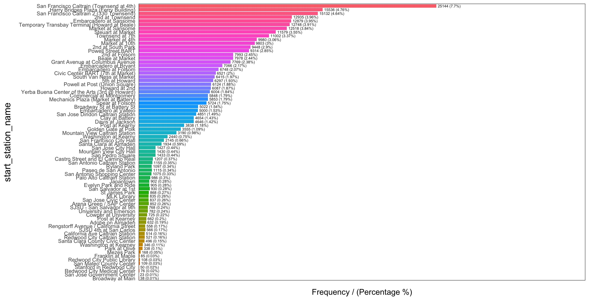
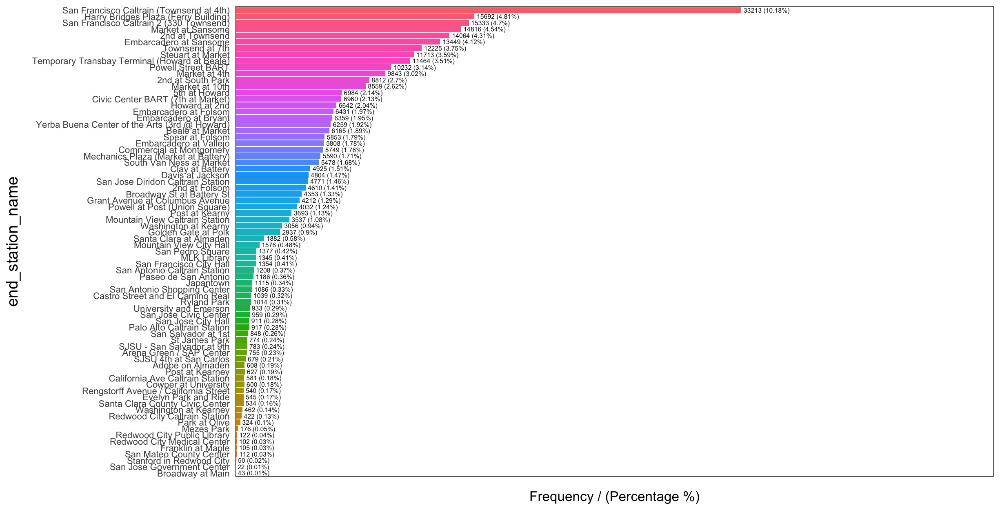
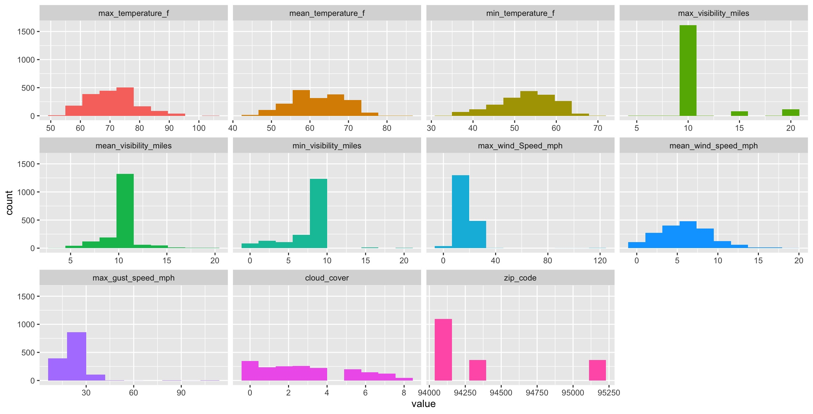
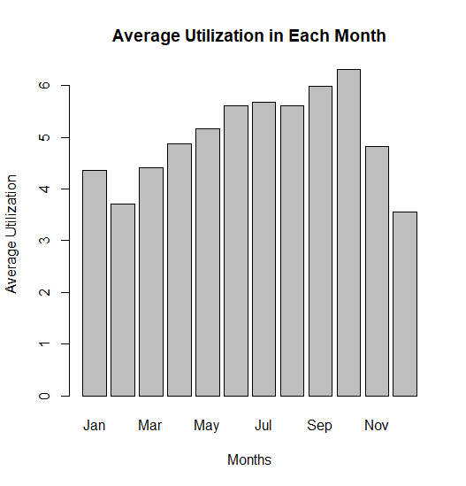
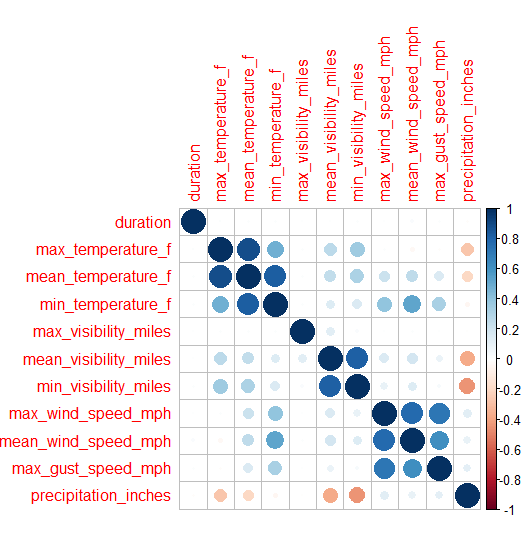

```{r setup, include=FALSE}
knitr::opts_chunk$set(echo = TRUE, warning = FALSE, message = FALSE, results = 'hide', fig.show = 'hide')
```

## Exploratory Descriptive Analysis: 

#### Trip Data

```{r trip_eda, include=FALSE}
library(funModeling)
library(tidyverse)
library(Hmisc)
trip <- read.csv("trip.csv", na.strings = "")
## First approach to data ##
glimpse(trip) # 326339 observations & 11 variables
status(trip) # zip_code has 50 zero values and 1493 missing values
## Analyzing categorical variables ##
freq(trip) #' The "San Francisco Caltrain (Townsend at 4th)" station had the highest frequency as starting station (25144) & end station (33213)
freq(trip, path_out = ".")
# Analyzing numerical variables
plot_num(trip)
  # 1 large peak: duration
  # Negatively skewed: start_station_id, end_station_id
  # Require conversion into factor: start_station_name, end_station_name
plot_num(trip, path_out = ".")
trip_prof <- profiling_num(trip)
  # Skewness: duration (539.65)
  # High std: duration (30816.16)
  # High variation_coef: duration(27.22)
# Analyzing categorical & numerical variables at the same time 
describe(trip)
```

The Trip dataset included `r nrow(trip)` observations and `r ncol(trip)` variables of interest including id, duration, start date, start station name, start station id, end station name, end station id, bike id, subscription type, and zip code. No missing value was observed with the exception of the “zip code” variable, which had 1493 missing values. Variables “start date” and “end date” follows the format of MM/DD/YYYY along with the time (H:M), which required conversion to the POSIX format to ensure consistency across datasets.

Duration was the only numerical variable of this dataset, while the remaining variables were converted into factors for analysis. The mean trip duration is 1131.96 seconds, with a high standard deviation of 30816.17 and a broad range from 60 to 17270400 seconds. The maximum duration translates to approximately 200 days, which reveals the presence of outlying values in this variable. A high variation coefficient of 27.22 was also observed. Furthermore, 98% of the duration values were observed to fall within the range [237, 1138], suggesting a positive skew of the distribution (Figure 1). 
	
Variables “start station name” and “end station name” included 74 unique stations, and the frequency of the stations was examined. For both variables, the “San Francisco Caltrain (Townsend at 4th)” station had the highest frequency, with a frequency of 25144 (7.70%) for the start station name, and 33213 (10.18%) for the end station name (Figure 2). Similarly, the “San Jose Government Center” station had the lowest frequency for both variables, with a frequency of 23 (0.01%) as the start station, and a frequency of 22 (0.01%) as the end station.

Variables “start station id” and “end station id” included 70 unique ids. As each unique id should correspond to a unique station, the discrepancy in the number of levels observed between station and id suggests the presence of duplicates, which is addressed in the data cleaning step of the analysis. In terms of the summarized frequency, “id 70” had the highest frequency for both the “start station id” and  “end station id” variables - it had a frequency of 25144 (7.70%) and 33213 (10.18%) for start and end station id, respectively (Figure 3). The frequencies are consistent with the station names frequencies, as “id 70” corresponds to the “San Jose Government Center” station. On the other hand, “id 26” had the lowest frequency of 76 (0.02%) for the start station id, while “id 25” had the lowest frequency of 112 (0.03%) for the end station id. 

Variable “bike id” had 687 unique values, with a relatively uniform frequency distribution. Subscription type is a binary variable with two levels: Subscriber and Customer. As visualized by the frequency plot (Figure 4), 277763 of the consumer are subscribers (85.11%), while the remaining 48576 are customers (14.89%). Variable “zip code” had 4887 unique values. However, 50 zero values and 1493 missing values were also observed. The zip code “94107” had the highest frequency of 36061 (11.05%).

#### Weather Data

```{r weather_eda, include=FALSE}
weather <- read.csv("weather.csv", na.strings = "")
## First approach to data ##
glimpse(weather) # 1825 observations & 15 variables
status(weather)
  # max_gust_speed_mph has 451 missing values
  # precipitation_inches has 1543 zero values 
  # cloud_cover, events, zip_code, and city are categorical variables (require conversion into factors)
## Analyzing categorical variables ##
freq(weather)
  # precipitation_inches: most observations (1543) have 0 inch precipitation, 73 has "T", numerical data treated as categorical
  # events: most observations (1473) have NAs; level "rain" can be combined with level "Rain"
  # city: all 5 cities have the same frequency
freq(weather, path_out = ".")
# Analyzing numerical variables
plot_num(weather)
  # No significant sign of outlier: max_temperature_f, mean_temperature_f, min_temperature_f, mean_wind_speed_mph
  # 1 large peak, relatively symmetrical: max_visibility_miles, mean_visibility_miles
  # Potential outlier: min_visibility_miles, max_wind_Speed_mph, max_gust_speed_mph
  # Require conversion into factor: cloud_cover, zip_code
plot_num(weather, path_out = ".")
weather_prof <- profiling_num(weather)
  # Skewness: max_wind_Speed_mph (7.47), max_gust_speed_mph (4.93), max_visibility_miles (2.88)
  # High std: max_gust_speed_mph (9.09), max_temperature_f (8.26), max_wind_Speed_mph (7.32)
  # High variation_coef: mean_wind_speed_mph (0.50), max_wind_Speed_mph (0.45), max_gust_speed_mph (0.40)
# Analyzing categorical & numerical variables at the same time 
describe(weather)
```

The Weather dataset included 1825 observations and 15 variables of interest including date, maximum temperature in Fahrenheit (max_temperature_f), mean temperature in Fahrenheit (mean_temperature_f), minimum temperature in Fahrenheit (min_temperature_f), maximum visibility in miles (max_visibility_miles), mean visibility in miles (mean_visibility_miles), minimum visibility in miles (min_visibility_miles), maximum wind speed in miles per hour (max_wind_Speed_mph), mean wind speed in miles per hour (mean_wind_speed_mph), maximum gust speed in miles per hour (max_gust_speed_mph), precipitation in inches, cloud cover, events, zip code, and city. 

Missing values were observed for variables max_visibility_miles (9), mean_visibility_miles (9), min_visibility_miles (9), max_gust_speed_mph (451), and events (1473). Zero values were observed for variables min_visibility_miles (53), mean_wind_speed_mph (11), precipitation_inches (1543), cloud_cover (347). Variable “date” follows the format of MM/DD/YYYY, which required conversion to the POSIX format to ensure consistency across datasets. Variable conversion was necessary to ensure appropriate data type. Specifically, the variable “precipitation_inches” has a character type due to the inclusion of seventy-three “T” values with numeric values, and required conversion to a numerical variable. The variables cloud cover, events, zip code, and city required conversion into factors in order to summarize frequencies. 	

The quantitative variables of this dataset are measurements of temperature, visibility, wind speed, gust speed, and precipitation inches. The mean, standard deviation, variation of coefficient, and the skewness of quantitative variables are summarized in Table 1. In addition, histograms are plotted to examine the distribution of the data of these variables (Figure 5). 

The calculated mean of the maximum, mean, and minimum temperatures in Fahrenheit were 71.03, 62.03 and 52.83, respectively. The observed ranges of the maximum, mean, and minimum temperatures in Fahrenheit were [50.00, 102.00], [44.00, 84.00], and [32.00, 69.00], respectively. No significant outlier was observed for all three variables suggested by the low value of variation coefficients (0.12, 0.11, 0.13, respectively). The distribution of the data was relatively symmetrical, with no significant skewing observed (Figure 5). 

The calculated mean of the maximum, mean, and minimum visibility in miles were 10.86, 9.97 and 8.11, respectively. All three variables had a relatively narrow and consistent range. The observed ranges of the maximum, mean, and minimum temperatures in Fahrenheit were [5.00, 20.00], [4.00, 20.00], and [0.00, 20.00], respectively. Notably, variables “max_visibility_miles” and “mean_visibility_miles” had an interquartile range of 0, suggesting that there is no variability in the 50% of the data for these variables. 

The calculated mean of the maximum and mean wind speed in miles per hour were 16.44 and 6.11, respectively. Maximum gust speed had a mean of 22.69 miles per hour. The mean wind speed had a relatively symmetrical distribution with a range of [0.00, 19.00]. No significant skewness or outliers was observed from the histogram (Figure 5). Conversely, the maximum wind speed and the maximum gust speed had a wide range of [4.00, 122.00] and [6.00, 114.00], respectively. The distributions were positively skewed, and the values of skewness were 7.47 for maximum wind speed and 4.92 for maximum gust speed,  suggesting the presence of outliers in these variables. 

**Table 1:** Weather Characteristics

|Variables|Mean ± SD|Variation Coef|Skewness|
|:------|:-------:|:-------:|:-------:|
|max_temperature_f|71.03 ± 8.26|0.12|0.25|
|mean_temperature_f|62.03 ± 6.75|0.11|-0.15|
|min_temperature_f|52.83 ± 6.67|0.13|-0.48|
|max_visibility_miles|10.86 ± 2.62|0.24|2.89|
|mean_visibility_miles|9.97 ± 1.62|0.16|1.78|
|min_visibility_miles|8.11 ± 3.04|0.37|-1.03|
|max_wind_Speed_mph|16.44 ± 7.32|0.45|7.47|
|mean_wind_speed_mph|6.11 ± 3.05|0.50|0.46|
|max_gust_speed_mph|22.69 ± 9.09|0.40|4.93|

Cloud cover had 9 unique values, with higher values representing higher degree of cloud coverage. Figure 6 provided a visual illustration of the frequencies for different cloud coverage levels. Notably, a decreasing trend was observed, whereby the higher degree of cloud coverage had relatively fewer counts of observations. Level “0” had the highest frequency of 347 (19.01%), while level “8” had the lowest frequency of 45 (2.47%) 

The levels of the variable “events” was visualised using the bar plot, and 5 levels (excluding the NA level) were observed: Rain, Fog, Fog-Rain, Rain-Thunderstorm, and rain (Figure 7). Despite describing the same event, levels “Rain” and “rain” were differentiated due to the case-sensitive nature of R, therefore can be combined in the subsequent data cleaning step. As noted earlier, 1473 observations (80.71%) had missing values for “events”. For the remaining levels, the frequencies were 280 (15.34%), 57 (3.12%), 13 (0.71%), 1 (0.05%), and 1 (0.05%) for Rain, Fog, Fog-Rain, Rain-Thunderstorm, and rain, respectively. 

City is a categorical variable with 5 levels: San Jose, San Francisco, Redwood City, Palo Alto, and Mountain View. The observations are equally distributed among the 5 levels, whereby each city had a frequency of 365 (20%). In addition, each city had a corresponding zip code (95113, 94301, 94107, 94063, 94041) as shown in Figure 8. 


## Analysis

#### Trip Data: Data Cleaning & Removal of Outliers

```{r trip_conversion, include=FALSE}
station <- read.csv("station.csv")
trip1 <- trip %>%
  # start_station_name & end_station_name
  mutate(start_station_name = as.factor(start_station_name)) %>%
  mutate(end_station_name = as.factor(end_station_name)) %>%
  
  # start_station_id & end_station_id
  mutate(start_station_id = as.factor(start_station_id)) %>%
  mutate(end_station_id = as.factor(end_station_id)) %>%
  
  # bike_id
  mutate(bike_id = as.factor(bike_id)) %>%
  
  # subscription_type
  mutate(subscription_type = as.factor(subscription_type)) %>%
  
  # zip_code
  mutate(zip_code = as.factor(zip_code))
```

```{r trip_cancelled, include=FALSE}
  # Number of likely cancelled trips (2499 obs)
sum(trip1$duration < 120)
  # Remove likely cancelled trips (left with 323840 obs)
trip2 <- trip1 %>%
  filter(duration >= 120)
```

```{r trip_outliers, include=FALSE}
summary(trip2)
summary(trip2$duration) # Maximum duration: 17270400s (199.89 days)
hist(log10(trip2$duration))
boxplot(log10(trip2$duration))
  # Remove outliers based on IQR (Q3 + 1.5 * IQR or Q1 - 1.5 * IQR)
trip2q <- quantile(trip2$duration) # Q1 = 345; Q3 = 748
trip2iqr <- IQR(trip2$duration) # IQR = 403
upperlimit <- trip2q[4] + 1.5*trip2iqr
lowerlimit <- trip2q[2] - 1.5*trip2iqr
trip3 <- trip2 %>%
  filter(duration < upperlimit) %>%
  filter(duration > lowerlimit)
summary(trip3$duration)
```

```{r trip_invalidstation, include=FALSE}
  # Inconsistent spelling between the trip.csv & station.csv file
  # Ensure consistency by replacing all "Kearny" in trip2 with "Kearney"
trip3$start_station_name <- stringr::str_replace(trip3$start_station_name, "Kearny", "Kearney")
trip3$end_station_name <- stringr::str_replace(trip3$end_station_name, "Kearny", "Kearney")
  # Inconsistency due to duplication 
length(unique(trip3$start_station_id)) # 70 unique start station ids
length(unique(trip3$start_station_name)) # 72 unique start station names
  # Filter out trips where the start/end station name is not found in the station.csv
trip4 <- trip3 %>%
  filter(start_station_name %in% station$name) %>%
  filter(end_station_name %in% station$name) %>%
  
  # Filter out trips where the start/end station id is not found in the station.csv
  filter(start_station_id %in% station$id) %>%
  filter(end_station_id %in% station$id)
  #' Observation: All excluded observations were trips to/from "Broadway at Main" 
  #' or "San Jose Government Center", which are not found in the station.csv file.
  #' In the trip dataset, both the "San Jose Government Center" station and the 
  #' "Santa Clara County Civic Center" station has a station id of 80. To be 
  #' consistent with the station dataset, station id 80 corresponds to the 
  #' "Santa Clara County Civic Center" station, and observations with "San Jose 
  #' Government Center" station are removed
table(trip3$start_station_name[trip3$start_station_id == "80"])
  # Writing the cleaned trip csv file
write.csv(trip4, file = "trip_clean.csv")
```

The first step of our analysis involved data formatting and variable conversion. Variables “start_station_name”, “end_station_name”, “start_station_id”, “end_station_id”, “bike_id”, “subscription_type”, and “zip_code” were converted into factors using the mutate() and as.factor() function in R. 

Observations that had an duration of less than 2 minutes were removed from the dataset using the filter() function, under the assumption that these are cancelled trips. As a result, 2499 observations were removed from the dataset, leaving 323840 observations for further analysis. Considering the broad range and high variation coefficient value of the Duration variable, potential outliers were removed based on the interquartile range (IQR). Specifically, the upper and lower limits were determined by multiplying IQR by 1.5; observations that were 1.5 times the interquartile range more than the third quartile, or 1.5 times the interquartile range less than the first quartile were considered the outliers and removed from the dataset. In this case, the upper and the lower limits were 1352.5 and -259.5, respectively. As a result, 24927 observations were removed from the dataset, leaving 298913 observations for further analysis. 

Subsequent steps of data cleaning involved ensuring the consistency and validity of the stations in the Trip data, by using the station.csv file as the reference. Inconsistent spelling of station names was observed between the trip.csv and station.csv file. Specifically, the location “Kearney” was spelt as “Kearny” in the trip.csv file. Assuming that the discrepancy was due to spelling errors, the str_replace() function in the “stringr” package was employed to replace all “Kearny” in the Trip data with “Kearney”. Furthermore, duplication in station id was observed in the Exploratory Descriptive Analysis stage using the unique() function. With 72 unique start station names, there were only 70 unique station ids. Therefore, the filter() function was used in combination with %in% to filter out trips where the start or end station name (or id) is not found in the station.csv file. As a result, 83 observations were removed from the dataset, which included trips to or from the “Broadway at Main” or “San Jose Government Center” stations. With a closer examination, it was observed that both the “San Jose Government Center” and the “Santa Clara County Civic Center” stations had a station id of 80 in the Trip data. To be consistent with station.csv, it was assumed that station id 80 corresponds to the “Santa Clara County Civic Center” station. Therefore, observations with the “San Jose Government Center” station were removed from the dataset.

The final clean Trip data included a total of 298830 observations. The cleaned data was written as trip_clean.csv and used for subsequent rush hour and correlation analysis. 

#### Weather Data: Data Cleaning & Removal of Outliers

```{r weather_conversion, include=FALSE}
weather1 <- weather %>%
  # cloud_cover
  mutate(cloud_cover = as.factor(cloud_cover)) %>%
  
  # events (changed NA to "No event"; combined levels "rain" and "Rain")
  mutate(events = replace(events, is.na(events), "No event")) %>%
  mutate(events = replace(events, events == "rain", "Rain")) %>%
  mutate(events = as.factor(events)) %>%
  # zip_code
  mutate(zip_code = as.factor(zip_code)) %>%
  
  # city
  mutate(city = as.factor(city)) %>%
  
  # precipitation_inches ("T" is assumed to be trace amount, therefore is converted to 0)
  mutate(precipitation_inches = replace(precipitation_inches, precipitation_inches == "T", 0)) %>%
  mutate(precipitation_inches = as.numeric(as.character(precipitation_inches))) %>%
  # date
  mutate(date = as.POSIXct(date, format="%m/%d/%Y"))
  # Rename the variable max_wind_Speed_mph to be consistent with the remaining variable 
weather2 <- weather1 %>%
  rename("max_wind_speed_mph" = "max_wind_Speed_mph")
```

```{r weather_na, include=FALSE}
which(is.na(weather1$max_visibility_miles))
which(is.na(weather1$mean_visibility_miles))
which(is.na(weather1$min_visibility_miles))
  #' There are 9 observations that did not report max_visibility_miles,
  #' mean_visibility_miles, or min_visibility_miles, therefore, these 9 observations
  #' are removed. 
weather3 <- weather2 %>%
  filter(!is.na(max_visibility_miles))
```

```{r weather_outliers, include=FALSE}
  # max_temperature_f
outlier1 <- boxplot(weather3$max_temperature_f)$out
  # min_temperature_f
outlier2 <- boxplot(weather3$min_temperature_f)$out 
  # max_wind_speed_mph
outlier3 <- boxplot(weather3$max_wind_speed_mph)$out
  # mean_wind_speed_mph
outlier4 <- boxplot(weather3$mean_wind_speed_mph)$out
  # max_gust_speed_mph
outlier5 <- boxplot(weather3$max_gust_speed_mph)$out
# No outliers are removed for the following variables:
  # mean_temperature_f: no outliers observed
boxplot(weather3$mean_temperature_f)$out
  # max_visibility_miles: IQR = 0
boxplot(weather3$max_visibility_miles)$out
IQR(weather3$max_visibility_miles, na.rm=T)
  # mean_visibility_miles: IQR = 0
boxplot(weather3$mean_visibility_miles)$out
IQR(weather3$mean_visibility_miles, na.rm=T)
  # min_visibility_miles
boxplot(weather3$min_visibility_miles)$out
  # precipitation_inches
boxplot(weather3$precipitation_inches)$out
weather4 <- weather3 %>%
  filter(!(max_temperature_f %in% outlier1)) %>%
  filter(!(min_temperature_f %in% outlier2)) %>%
  filter(!(max_wind_speed_mph %in% outlier3)) %>%
  filter(!(mean_wind_speed_mph %in% outlier4)) %>%
  filter(!(max_gust_speed_mph %in% outlier5))
  
write.csv(weather4, file = "weather_clean.csv")
```

The first step of our analysis involved data formatting and variable conversion. Variables “cloud_cover”, “events”, “zip_code”, and “city” were converted into factors using the mutate() and as.factor() function in R. Variable “date” was converted to the standard POSIX format using the as.POSIXct function. Additional manipulation was performed with the “events” variable. Firstly, levels “rain” and “Rain” were combined into a single level. In addition, for the purpose of enhancing the completeness of the data, all missing values were converted to “No event” using the replace() and mutate() functions. These functions were also used for the transformation of the “precipitation_inches” variable, which was recognized as a categorical variable in R due to the inclusion of “T” values. To address this, “T” was assumed to be a trace amount, and was converted to 0. 

It was previously noticed that there were 9 observations that had missing data for all three measurements of visibility (maximum, mean, and minimum) in the Weather data. Therefore, these rows were removed from the dataset, leaving a total number of 1816 observations. 

Lastly, to address the outliers in the Weather data, the boxplot approach was implemented. It was assumed that any data point that fell beyond the extremes of the whiskers of the boxplot were outliers, and therefore were removed from the dataset. This was achieved using the boxplot()$out to extract outlying values of each variable of interest, which were stored separately as vectors. The filter() function was then combined with %in% to remove any values that were seen in the outlier vector of the corresponding variable. As a result, outliers were removed for variables max_temperature_f, min_temperature_f, max_wind_speed_mph, mean_wind_speed_mph, and max_gust_speed _mph. No outliers are removed for the remaining 5 variables due to the absence of outliers, zero IQR values, or limited available data. 

The final clean Weather data included a total of 1737 observations. The cleaned data was written as weather_clean.csv and used for subsequent rush hour and correlation analysis. 

#### Rush Hour & Average Bike Utilization

```{r rush_hour, include=FALSE}
options(repos = list(CRAN="http://cran.rstudio.com/"))
library(lubridate)
library(tidyr)
station <- read.csv("station.csv")
trip_clean <- read.csv("trip_clean.csv")
weather_clean <- read.csv("weather_clean.csv")
## Data tranformation ##
trip4 <- trip_clean %>%
  # Creating new variable trip_day
  mutate(start_date = as.POSIXct(start_date, format="%m/%d/%Y %H:%M")) %>%
  mutate(trip_day = wday(start_date, label=TRUE, abbr=FALSE)) %>%
  
  # Subsetting the weekdays 
  filter(trip_day != "Saturday") %>%
  filter(trip_day != "Sunday") %>%
  
  # Extract time from start_date
  mutate(start_hour = hour(start_date))
# Shows the counts of weekdays
dplyr::count(trip4, trip4$trip_day)
trip5 <- trip_clean %>%
  # trip 5 includes weekdays and weekends
  mutate(start_date = as.POSIXct(start_date, format="%m/%d/%Y%H:%M")) %>%
  mutate(trip_day = wday(start_date, label=TRUE, abbr=FALSE))
## Determine Rush Hour ##
# Overall rush hours for weekdays
densityX <- density(trip4$start_hour)$x
densityY <- density(trip4$start_hour)$y
rushhour <- densityX[which(diff(sign(diff(densityY)))==-2)]
rushhour
# Rush hours for Mondays
tripmonday <- filter(trip4, trip4$trip_day == "Monday")
densitymondayX <- density(tripmonday$start_hour)$x
densitymondayY <- density(tripmonday$start_hour)$y
rushhourmonday <- densitymondayX[which(diff(sign(diff(densitymondayY)))==-2)]
rushhourmonday
# Rush hours for Tuesdays
triptuesday <- filter(trip4, trip4$trip_day == "Tuesday")
densitytuesdayX <- density(triptuesday$start_hour)$x
densitytuesdayY <- density(triptuesday$start_hour)$y
rushhourtuesday <- densitytuesdayX[which(diff(sign(diff(densitytuesdayY)))==-2)]
rushhourtuesday
# Rush hours for Wednesday
tripwed <- filter(trip4, trip4$trip_day == "Wednesday")
densitywedX <- density(tripwed$start_hour)$x
densitywedY <- density(tripwed$start_hour)$y
rushhourwed <- densitywedX[which(diff(sign(diff(densitywedY)))==-2)]
rushhourwed
# Rush hours for Thursday
tripthurs <- filter(trip4, trip4$trip_day == "Thursday")
densitythursX <- density(tripthurs$start_hour)$x
densitythursY <- density(tripthurs$start_hour)$y
rushhourthurs <- densitythursX[which(diff(sign(diff(densitythursY)))==-2)]
rushhourthurs
# Rush hours for Friday
tripfri <- filter(trip4, trip4$trip_day == "Friday")
densityfriX <- density(tripfri$start_hour)$x
densityfriY <- density(tripfri$start_hour)$y
rushhourfri <- densityfriX[which(diff(sign(diff(densityfriY)))==-2)]
rushhourfri
## GGPlots showing highest trip volume ##
install.packages("ggpubr")
library("ggpubr")
allggplots <- ggarrange(ggplot(trip4, aes(start_hour)) + geom_density(),
                        ggplot(tripmonday, aes(start_hour)) + geom_density(),
                        ggplot(triptuesday, aes(start_hour)) + geom_density(),
                        ggplot(tripwed, aes(start_hour)) + geom_density(),
                        ggplot(tripthurs, aes(start_hour)) + geom_density(),
                        ggplot(tripfri, aes(start_hour)) + geom_density(),
                        labels = c("A", "B", "C", "D", "E", "F"),
                        ncol = 3, nrow = 2)
allggplots
```

```{r frequent_station, include=FALSE}
## Determining Frequent Station - Weekdays ##
# Finding the 10 most frequent start and end stations during morning rush hours
morning_rush <- trip4 %>%
  filter(start_hour == 8)
head(dplyr::count(morning_rush, morning_rush$start_station_name, sort = T), 10)
head(dplyr::count(morning_rush, morning_rush$end_station_name, sort = T), 10)
# Finding the 10 most frequent start and end stations during evening rush hours
evening_rush <- trip4 %>%
  filter(start_hour == 17)
head(dplyr::count(evening_rush, evening_rush$start_station_name, sort = T), 10)
head(dplyr::count(evening_rush, evening_rush$end_station_name, sort = T), 10)
## Determining Frequent Station - Weekends ##
# Finding the 10 most frequent start and end stations on weekends
tripweekend <- trip5 %>%
  filter(trip_day == "Saturday" | trip_day == "Sunday")
head(dplyr::count(tripweekend, tripweekend$start_station_name, sort = T), 10)
head(dplyr::count(tripweekend, tripweekend$end_station_name, sort = T), 10)
# Using cbind to observe any overlap in station names on weekday rush hours and weekends
cbind(head(dplyr::count(morning_rush, morning_rush$start_station_name, sort = T), 10),
      head(dplyr::count(evening_rush, evening_rush$start_station_name, sort = T), 10),
      head(dplyr::count(tripweekend, tripweekend$start_station_name, sort = T), 10))
cbind(head(dplyr::count(morning_rush, morning_rush$end_station_name, sort = T), 10),
      head(dplyr::count(evening_rush, evening_rush$end_station_name, sort = T), 10),
      head(dplyr::count(tripweekend, tripweekend$end_station_name, sort = T), 10))
```

```{r avg_utilization, include=FALSE}
trip_avg_utilize <- trip5 %>%
  group_by(month(start_date)) %>%
  summarise_at(vars(duration), list(totalduration = sum))
trip_avg_utilize$`month(start_date)` <- month.abb[trip_avg_utilize$`month(start_date)`]
trip_avg_utilize$AvgUtilization <- ifelse(trip_avg_utilize$`month(start_date)` == "Jan"|
                                            trip_avg_utilize$`month(start_date)` == "Mar"|
                                            trip_avg_utilize$`month(start_date)` == "May"|
                                            trip_avg_utilize$`month(start_date)` == "Jul"|
                                            trip_avg_utilize$`month(start_date)` == "Aug"|
                                            trip_avg_utilize$`month(start_date)` == "Oct"|
                                            trip_avg_utilize$`month(start_date)` == "Dec",
                                          trip_avg_utilize$totalduration/2678400, 
                                          # Months with 31 days
                                          
                                          ifelse(trip_avg_utilize$`month(start_date)` == "Apr"|
                                                   trip_avg_utilize$`month(start_date)` == "Jun"|
                                                   trip_avg_utilize$`month(start_date)` == "Sep"|
                                                   trip_avg_utilize$`month(start_date)` == "Nov",
                                                 trip_avg_utilize$totalduration/2592000, 
                                                 # Months with 30 days
                                                 
                                                 trip_avg_utilize$totalduration/2419200))
                                                # February
barplot(trip_avg_utilize$AvgUtilization, names.arg = c("Jan", "Feb", "Mar", "Apr", "May", "Jun", "Jul", "Aug", "Sep", "Oct", "Nov", "Dec"), main = "Average Utilization in Each Month", xlab = "Months", ylab = "Average Utilization")
```

After cleaning the trip dataset, different functions were used to determine bike rental patterns for each day of the week. Using this output, frequent starting stations and ending stations were determined along with the average utilization of bikes for each month. First, the dataset was mutated to add days of the week associated with each date, along with the start hours. These parameters were used to construct ggplots for each weekday, in order to determine rush hours or peak bike rental times. On average, the rush hours for each weekday were determined to be around 8:00 AM and 5:00 PM. The exact peak hours for each weekday are illustrated in Table 2 and all associated ggplots are available in Figure 9 of the Appendix. As a result, these findings conclude that in the year 2014, peak bike rental hours during weekdays were 8:00 AM and 5:00 PM. 

Next, using the “dplyr” package, the ten most frequent start and end stations during rush hours were determined, which are illustrated in Table 3 (morning rush hour - 8:00 AM) and Table 4 (evening rush hour - 5:00 PM). Similarly, the same protocols were followed to determine the ten most frequent start and end stations on weekends, which are illustrated in Table 5. The cbind() function was used to compare these tables, from which frequent start stations in both weekday rush hours and weekends included San Francisco Caltrain (Townsend at 4th), San Francisco Caltrain 2 (330 Townsend) and 2nd at Townsend, while frequent end stations in both included San Francisco Caltrain (Townsend at 4th), 2nd at Townsend, Townsend at 7th,  Market at Sansome and Steuart at Market. Therefore, the data science team can use these finding to better plan their maintenance operation, knowing that renting pattern and the volume of use at these stations is the highest throughout the week, as compared to other stations which would require less attention due to decreased rental volume. 

In addition, to make maintenance operations more efficient, the average utilization of bikes for each month was calculated, giving an approximation of what part of the year is rental volume the highest, corresponding to increased maintenance services. The dataset was grouped by months, from which the total duration of bikes used per month was summed and used to calculate average utilization per month (total time used/total time in a month). The total duration of each month along with its average utilization rate is illustrated in Table 6 along with a graphical representation in Figure 10 of the Appendix. In general, the average utilization was found to be relatively high from May to October, the highest being 6.31 in October, indicating the month with the longest travel duration and therefore highest usage. December was found to have the lowest average utilization of about 3.56, indicating the month with the lowest usage. The team can use these conclusions to plan the frequency of their maintenance operation, knowing what time of the year bike rental volume and utilization rate is the highest.

**Table 2:** Indication of rush hour and the times where bike rental was the highest for each weekday.

|Rush Hour AM/PM|Monday|Tuesday|Wednesday|Thursday|Friday|Weekdays|
|:-------------|:----:|:-----:|:-------:|:------:|:----:|:------:|
|Rush Hour AM|7:59:14|7:59:17|7:59:11|7:59:17|7:59:15|7:56:46|
|Rush Hour PM|4:59:02|4:58:57|4:59:07|4:58:58|4:55:59|4:57:57|


**Table 3:** Indication of the ten most frequent start station and the ten most frequent end stations for each trip during morning rush hour timings (8:00 AM) on weekdays.

|Rank|Start Station Name|Count|End Station Name|Count|
|:--:|:----------------:|:---:|:--------------:|:---:|
|1|San Francisco Caltrain (Townsend at 4th)|6070|San Francisco Caltrain (Townsend at 4th)|3228|
|2|Harry Bridges Plaza (Ferry Building)|3426|2nd at Townsend|2404|
|3|San Francisco Caltrain 2 (330 Townsend)|3364|Townsend at 7th|2188|
|4|Temporary Transbay Terminal (Howard at Beale)|3110|Market at Sansome|2149|
|5|Steuart at Market|1912|Embarcadero at Sansome|1491|
|6|Grant Avenue at Columbus Avenue|1591|2nd at South Park|1422|
|7|2nd at Townsend|1289|San Francisco Caltrain 2 (330 Townsend)|1400|
|8|Embarcadero at Bryant|1120|Howard at 2nd|1386|
|9|Civic Center BART (7th at Market)|1108|Embarcadero at Folsom|1356|
|10|South Van Ness at Market|1001|Steuart at Market|1303|


**Table 4:** Indication of the ten most frequent start station and the ten most frequent end stations for each trip during evening rush hour timings (5:00 PM) on week days.

|Rank|Start Station Name|Count|End Station Name|Count|
|:--:|:----------------:|:---:|:--------------:|:---:|
|1|Townsend at 7th|1844|San Francisco Caltrain (Townsend at 4th)|6501|
|2|San Francisco Caltrain (Townsend at 4th)|1778|San Francisco Caltrain 2 (330 Townsend)|3541|
|3|2nd at Townsend|1700|Harry Bridges Plaza (Ferry Building)|2319|
|4|Market at Sansome|1685|Temporary Transbay Terminal (Howard at Beale)|2101|
|5|2nd at South Park|1500|Steuart at Market|1951|
|6|Embarcadero at Sansome|1419|Market at Sansome|1448|
|7|Steuart at Market|1334|Powell Street BART|1074|
|8|San Francisco Caltrain 2 (330 Townsend)|1262|2nd at Townsend|1073|
|9|Embarcadero at Folsom|1208|Civic Center BART (7th atMarket)|1047|
|10|Commercial at Montgomery|1207|Townsend at 7th 980|


**Table 5:** Indication of the ten most frequent start station and the ten most frequent end stations for each trip during weekends.

|Rank|Start Station Name|End Station Name|
|:--:|:----------------:|:--------------:|
|1|Embarcadero at Sansome|Harry Bridges Plaza (Ferry Building)|
|2|Harry Bridges Plaza (Ferry Building)|Embarcadero at Sansome|
|3|Market at 4th|Market at 4th|
|4|2nd at Townsend|Powell Street BART|
|5|Embarcadero at Bryant|San Francisco Caltrain (Townsend at 4th)|
|6|Powell Street BART|2nd at Townsend|
|7|San Francisco Caltrain (Townsend at 4th)|Embarcadero at Bryant|
|8|Grant Avenue at Columbus Avenue|Steuart at Market|
|9|San Francisco Caltrain 2 (330 Townsend)|Townsend at 7th|
|10|Market at 10th|Market at Sansome|


**Table 6:** Indication of the average utilization of bikes per month in 2014.

|Month|Total Duration (s)|Average Utilization|
|:---:|:----------------:|:-----------------:|
|January|11670250|4.36|
|February|8958953|3.70|
|March|11816467|4.41|
|April|12633978|4.87|
|May|13817814|5.16|
|June|14536835|5.61|
|July|15226850|5.69|
|August|15035810|5.61|
|September|15493586|5.98|
|October|16889051|6.31|
|November|12514935|4.83|
|December|9529052|3.56|

#### Relationship Between Weather & Bike Rental Patterns

```{r trip_join, include=FALSE}
trip_clean <- read.csv("trip_clean.csv")
station <- read.csv("station.csv")
weather_clean <- read.csv("weather_clean.csv")
### Tables to be joined ###
trip5 <- trip_clean %>%
  mutate(start_date = as.POSIXct(start_date, format="%m/%d/%Y%H:%M")) %>%
  mutate(trip_day = wday(start_date, label=TRUE, abbr=FALSE))
weather_clean
station
### Joining tables ###
# Joining station & trip5 by station id (to get city)
stationtrip_join <- inner_join(station, trip5, by = c("id" = "start_station_id"))
  # Create a new variable to extract date from start_date in stationtrip_join 
stationtrip_join <- stationtrip_join %>%
  mutate(date = as.Date(start_date))
  
  # Convert variable "date" in weather_clean to class date for consistency
weather_clean <- weather_clean %>%
  mutate(date = as.Date(date))
# Joining stationtrip_join & weather_clean by date and city
weather_join <- inner_join(stationtrip_join, weather_clean, by = c("date" = "date", "city" = "city"))
# Select weather variables from the joined table
weather_join1 <- weather_join %>%
  select(c(duration, max_temperature_f:precipitation_inches))
### Correlation ###
install.packages("corrplot")
library("corrplot")
cor_matrix <- cor(weather_join1, use="complete.obs")
corrplot(cor_matrix, method = "circle")
```

The average utilization rate and bike rental patterns are highly dependent on external factors like weather. Therefore it is important to know the association between these factors to ensure maintenance services and other operations are efficient. To determine the association between weather conditions and bike rental patterns, the associated datasets were merged using the inner join method in order to return a data frame with all matched rows. First, the station dataset and the trip dataset were joined by the station id, which would construct a city column within the trip data. Next, the newly created data frame was joined with the weather dataset using dates and cities. 

This dataset would contain the duration of the trips along with each weather condition, from which correlations can be computed. All correlation coefficients between duration and the mean of each weather variable are illustrated in Table 7 and a graphical representation can be found in Figure 11 of the Appendix. All correlation coefficients were found to be slightly positive indicating a very weak positive relationship between each weather condition and the duration of the trip. In other words, as temperature, visibility, wind speed or gust speed increase, the duration of the trip increases. It is important to note that the coefficients were relatively close to 0, this may be significant enough to conclude that there is no relationship between weather conditions and duration. In other words, the condition of the weather does not affect the duration of the trip. This conclusion contradicts the expectation as usually an increase in temperature and visibility should increase duration significantly while a decrease in wind and gust speed should increase duration. This contradiction may be a result of an error caused by the presence of a significantly large number of missing values.

**Table 7:** Indication of the correlation coefficients for the relationship between trip duration (in seconds)
and each weather condition.

|        |Temperature|Visibility|Wind Speed|Gust Speed|
|:------:|:---------:|:--------:|---------:|:--------:|
|Duration|0.0024|0.0080|0.03780|0.0225|


## Appendix

#### Exploratory descriptive analysis: Trip data

 



#### Exploratory descriptive analysis: Weather data



#### Rush Hour






